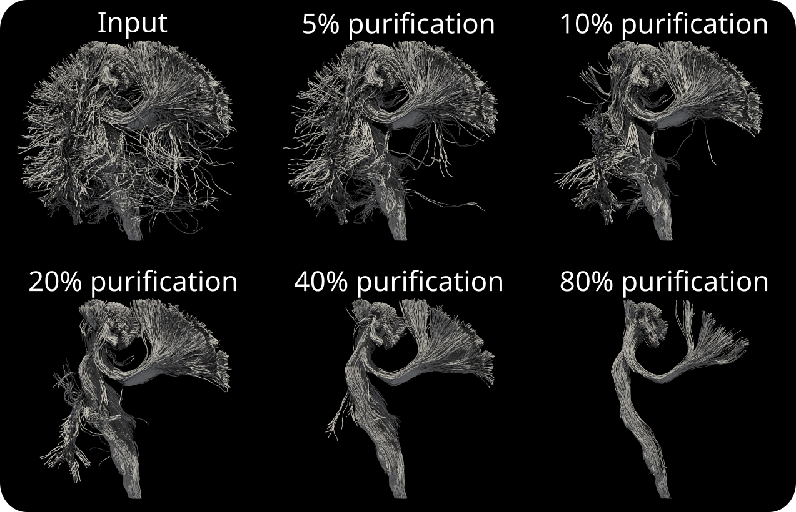

# purifibre

Purifibre cleans tractograms. It is a single word command line tool for Linux and Windows.



#### Usage:

```shell
purifibre <input> <output> [OPTIONS]
```

- **input**: can be a .vtk or .tck file

- **output**: only .vtk output is supported.

#### Options:

- **-p,--purify** FLOAT: Percentage of streamlines to remove from the tractogram. Default: 5.

- **-t,--trim** FLOAT: Trim excludes ends of streamlines from being analyzed. E.g., when trim is 10, 90% of the streamline is analyzed. 5% of the streamline length from each end is excluded from the computation. Default: 10.

- **-v,--voxDim** FLOAT: Isotropic voxel dimension when computing anisotropically smoothed track orientation density imaging (sTODI). Default: 4.

- **--anisotropicSmoothing [FLOAT,INT]**: Standard deviation of the Gaussian kernel (in mm), and computation density for anisotropic smoothing (number of streamlines). E.g. when set to 2 100, smoothing is done using 100 streamlines randomly distributed around each streamline using a Gaussion distribution with standard deviation of 2 mm. Default=0 0.

- **--sphericalSmoothing FLOAT**: Amount of sTODI spherical smoothing. Default: 30.

- **--save_fico TEXT**: Saves a .vtk formatted copy of input tractogram with fiber-to-bundle coupling (FICO) values written as a field.

- **-n,--numberOfThreads INT**: Number of threads. Default: max available in system.

- **--verbose**: Display info on terminal

- **-f,--force**: Force overwriting of existing output

#### Tips:

For deeper cleaning, try decreasing voxDim and increasing anisotropic smoothing.

###### Example:

```shell
purifibre <input> <output> --voxDim 1 --anisotropicSmoothing 2 100
```

#### Citation:

> Aydogan D. B. "Fiber coupling (FICO) measure using anisotropic smoothing of track orientation density images for tractogram filtering", ISMRM 2022

---

## Installation

##### Stand-alone executables:

- *Linux* executable: [purifibre_linux_v0.1](https://github.com/baranaydogan/purifibre/blob/main/binaries/purifibre_linux_v0.1).

- *Windows* executable: [purifibre_win_v0.1.exe](https://github.com/baranaydogan/purifibre/blob/main/binaries/purifibre_win_v0.1.exe).

##### Building from source:

**Step 1.** Download the source code:

```shell
git clone https://github.com/baranaydogan/purifibre
```

**Step 2.** Modify the first few lines in the build script (make sure to have cmake-3.15 or newer and a C/C++ compiler with C++-14 support, e.g. gcc-6 or newer, or  MSVC 2017 or newer):

- For Linux -> build_Linux.sh
- For Windows -> build_Windows.bat

**Step 3.** Run the build script. This will build **purifibre** under <PurifibreFolder>/build/install

---

## License

Purifibre is distributed under a 3-Clause BSD license. For command line parsing it uses the beatiful [CLI11](https://github.com/CLIUtils/CLI11), developed by Henri Schreiner.

---

&copy; 2022 Dogu Baran Aydogan, baran.aydogan@uef.fi
